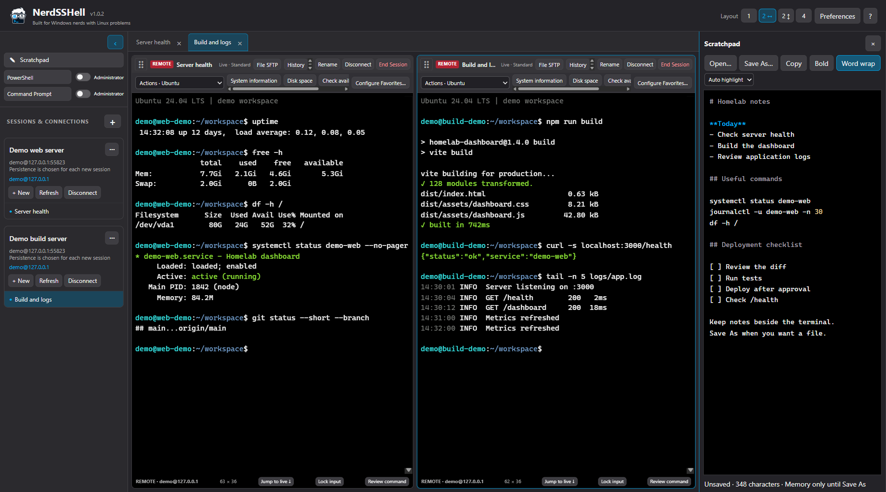
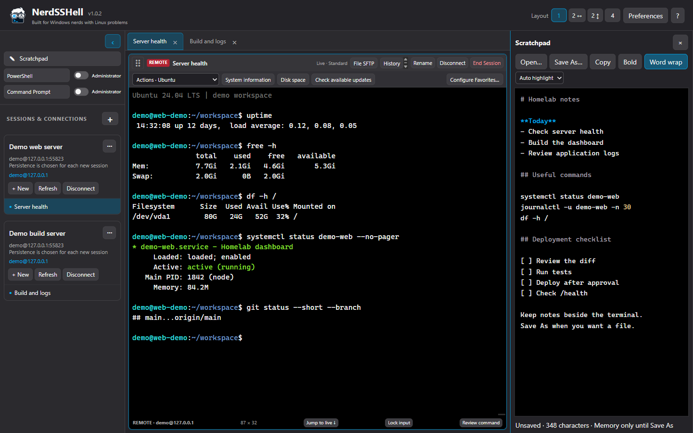

<picture>
  <source media="(prefers-color-scheme: dark)" srcset="assets/branding/nerdsshell/production/wordmark-dark-tagline.svg">
  <source media="(prefers-color-scheme: light)" srcset="assets/branding/nerdsshell/production/wordmark-light-tagline.svg">
  
</picture>

# NerdSSHell

**Built for Windows nerds with Linux problems.**

NerdSSHell is a Windows workspace for SSH, persistent remote sessions, local PowerShell and Command Prompt. Keep your servers, split terminals, file transfers and notes together. It is designed for developers and homelab users who work on Linux from a Windows desktop.

[User manual](https://github.com/zeidlern/NerdSSHell/wiki) · [Downloads](https://github.com/zeidlern/NerdSSHell/releases) · [Report a bug](https://github.com/zeidlern/NerdSSHell/issues/new?template=bug_report.yml) · [Request a feature](https://github.com/zeidlern/NerdSSHell/issues/new?template=feature_request.yml)

## Why NerdSSHell?

| Feature | What it helps you do |
| --- | --- |
| Saved SSH connections | Keep server settings and approved host fingerprints together |
| Persistent sessions with tmux | Close the client and reconnect to remote work later |
| Standard SSH | Open an ordinary remote shell without requiring tmux |
| Windows consoles | Use PowerShell and Command Prompt beside SSH; optionally launch a new Administrator console |
| Tabs and split panes | Arrange one, two or four terminals with resizable dividers |
| File SFTP | Browse Local/Remote folders per terminal and copy files with upload/download confirmation |
| Actions and Favorites | Submit configured commands into their originating terminal |
| Command workbench | Review a script and run it in a new selected console |
| Scratchpad and alerts | Keep plain-text notes and receive optional alerts for recognized background prompts |
| Preferences | Customize terminal colors, clipboard behavior, commands and history |

## Screenshots

NerdSSHell 1.0.2 in dark mode, using disposable demo connections and sample terminal output. Click an image to view it at full size.

**Two terminals with a shared scratchpad** — watch server health and build output side by side while keeping notes in view.



**One terminal with a scratchpad** — give the active session more room while keeping commands and a checklist nearby.



## Install

The supported desktop platform is **Windows 11 x64**. Official installers bundle the runtime; Node.js, Git and Codex are not required to run them.

Download Windows installers from [GitHub Releases](https://github.com/zeidlern/NerdSSHell/releases). Each release identifies available assets, checksums, signing status and known limitations. If a release contains only source archives, use the source-build instructions below. Check the exact asset's checksum and publisher status before installing; an unsigned build has no verified publisher identity. See [installation, upgrades and removal](docs/wiki/Installation.md).

Remote connections require a reachable SSH server. Persistent sessions need **tmux 3.2 or newer**; file transfer needs the server's SFTP subsystem. Local consoles work without a server.

## First connection

1. Add a connection with the server address, username and authentication method.
2. Verify the server's host fingerprint through an independent trusted source before accepting it.
3. Create a **Persistent session** to keep work on the server, or uncheck persistence for **Standard SSH**.
4. Choose a layout, open **File SFTP**, or use the **Scratchpad** as needed.

**Persistent Close/Disconnect leaves remote work running.** **End** terminates it after confirmation. A server reboot or server-side termination still stops that work. Standard SSH and local consoles cannot be reattached after closure and their work may stop.

**Actions and Favorites send a command plus Enter into the current terminal context.** Check the host, account, program and partial input line before clicking. The separate workbench provides command review for a new console.

Disk recording is off by default. Archives, exports, saved notes and backups are plaintext. Copy-on-selection is on by default and can put terminal text into Windows clipboard history. Read [security and privacy](docs/wiki/Security-and-Privacy.md).

## Build from source

Use Windows 11 x64, Git and a current **Node 22 x64 version at least 22.12.0**. Clone the repository and select the release tag or commit you intend to build:

```powershell
git clone https://github.com/zeidlern/NerdSSHell.git
Set-Location NerdSSHell
git rev-parse HEAD
powershell.exe -NoProfile -File .\scripts\Install-Windows.ps1 -BuildOnly
if ($LASTEXITCODE -ne 0) { throw 'Build or verification failed.' }
node .\scripts\Verify-Notices.cjs
if ($LASTEXITCODE -ne 0) { throw 'License notice verification failed.' }
```

The helper installs locked dependencies with `npm ci --omit=optional`, runs source checks and tests, then builds and verifies the versioned installer. `-BuildOnly` stops before installation. Full commands, development launch, backups and policy-compatible alternatives are in the [installation guide](docs/wiki/Installation.md). Source use and redistribution remain subject to [LICENSE](LICENSE).

## Documentation and support

The [Wiki](https://github.com/zeidlern/NerdSSHell/wiki) covers connections, trust, sessions, SFTP, commands, notes, shortcuts, preferences and troubleshooting. Its [repository copy](docs/wiki/Home.md) is available with the source. The application's **Help and about** menu also opens the manual.

For help, see [SUPPORT.md](SUPPORT.md). Bugs and feature requests are welcome through [Issues](https://github.com/zeidlern/NerdSSHell/issues); focused pull requests are welcome through [CONTRIBUTING.md](CONTRIBUTING.md). Report security vulnerabilities [privately](SECURITY.md).

Windows ARM64, macOS/Linux desktop builds, mobile clients, ProxyJump, a tunneling UI, recursive/resumable folder transfer, cloud sync and unattended updates are not implemented. Prompt detection can miss unfamiliar programs. See [known limits](docs/wiki/Troubleshooting.md).

## License

NerdSSHell uses a custom **source-available license**. Official unmodified releases may be used personally or internally in a business. GitHub viewing and forking are governed by GitHub's terms; redistribution and publishing modified builds require the copyright holder's prior written permission. Read [LICENSE](LICENSE) for the complete terms. Third-party components retain their own licenses and [notices](docs/THIRD-PARTY-NOTICES.md).

[Changelog](CHANGELOG.md) · [Architecture](docs/ARCHITECTURE.md) · [Security policy](SECURITY.md) · [Release process](docs/PUBLIC-RELEASE.md) · [Identity compatibility](docs/IDENTITY-COMPATIBILITY.md)
